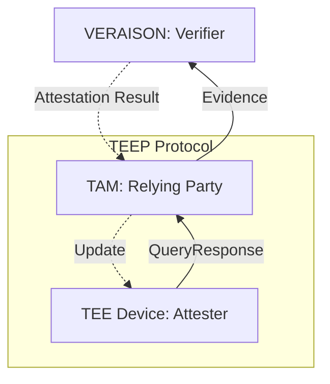

- [IETF124 Hackathon Demo](#ietf124-hackathon-demo)
  - [For Collaborators](#for-collaborators)
    - [To TAM operator](#to-tam-operator)
    - [To TEEP Agent implementor](#to-teep-agent-implementor)
    - [To Both TAM and TEEP Agent implementors](#to-both-tam-and-teep-agent-implementors)
  - [Generate SUIT Manifest](#generate-suit-manifest)
    - [Install requirements (Ruby)](#install-requirements-ruby)
    - [Install requirements (Rust)](#install-requirements-rust)
    - [Generate](#generate)
  - [Build SUIT Manifest Processor](#build-suit-manifest-processor)
    - [Install requirements (OpenSSL)](#install-requirements-openssl)
    - [Build](#build)
  - [Process app.wasm SUIT Manifest](#process-appwasm-suit-manifest)
    - [Install WasmRuntime](#install-wasmruntime)
    - [Run](#run)
  - [Generate and Test RATS PSA Token Evidence](#generate-and-test-rats-psa-token-evidence)
  - [Generate and Test TEEP Protocol Messages](#generate-and-test-teep-protocol-messages)

# IETF124 Hackathon Demo




> [!NOTE]
> Tested only in Ubuntu 22.04LTS
```sh
git clone --recursive https://github.com/kentakayama/ietf124
cd ietf124
```

## For Collaborators

### To TAM operator

The [prebuilt/app.wasm.envelope.cbor](./prebuilt/app.wasm.envelope.cbor) is the **untagged** SUIT Manifest to be transferred in the TEEP Protocol, and [prebuilt/manifest.diag](./prebuilt/manifest.diag) is its diagnostic notation.

Please send it to the TEEP Agent in TEEP Update messages.

> [!WARNING]
> The manifest uses ESP256 (alg id -9), which is not widely supported by most COSE libraries.
> If you use SUIT Manifest Processor other than one using libcsuit, please confirm that it supports the algorithm.

### To TEEP Agent implementor

The TAM would send the [prebuilt/app.wasm.envelope.cbor](./prebuilt/app.wasm.envelope.cbor) in TEEP Update message, process it using `suit_process_envelope()` libcsuit function. Please refer [process/suit_manifest_process_main.c](./process/suit_manifest_process_main.c).

> [!NOTE]
> The libcsuit parses the manifest and triggers some callback functions, like suit_condition_callback and suit_store_callback, depending on the manifest.
> You may need to modify them in the [process/suit_manifest_process_main.c](./process/suit_manifest_process_main.c).
> At least, it doesn't produce any SUIT_Report to be sent to the TAM in TEEP Success/Error messages.

### To Both TAM and TEEP Agent implementors

The prebuilt TEEP Protocol messages are in the `prebuilt/` directory.
You can print them with:

```sh
cbor2diag.rb -e prebuilt/query_request.tam.esp256.cose
cbor2diag.rb -e prebuilt/query_response.agent.esp256.cose
cbor2diag.rb -e prebuilt/update.tam.esp256.cose
```

To run these commands, you have to install cbor-diag (refer [Install requirements (Ruby)](#install-requirements-ruby)).

## Generate SUIT Manifest

### Install requirements (Ruby)
```sh
sudo apt install ruby ruby-rubygems
sudo gem install cbor-diag cbor-diag-e cbor-diag-ref cddl
```

### Install requirements (Rust)
```sh
curl https://sh.rustup.rs -sSf | sh
```

### Generate
```sh
make -C manifest/ test
```

> [!NOTE]
> The above command also validates the generated manifest against the CDDL definition of SUIT Manifest `cddl/suit-manifest.cddl`.
> If you customize any of `manifest/*.rediag` files, make sure you've done it well.
> In the files, `e'foo'` will be replaced with the actual value in the cddl file,
> and `ref'bar'` will be replaced the content in the filename `bar` in the directory.

## Build SUIT Manifest Processor

### Install requirements (OpenSSL)

```sh
sudo apt install openssl openssl-dev gcc
```

> [!TIP]
> You may use [MbedTLS](https://github.com/Mbed-TLS/mbedtls) instead of OpenSSL.
In that case, build t_cose with `Makefile.psa` and `make -C process MBEDTLS=1`.

### Build
```sh
make -C QCBOR libqcbor.a
make -C t_cose -f Makefile.ossl libt_cose.a
make -C libcsuit -f Makefile libcsuit.a
make -C process/
```

## Process app.wasm SUIT Manifest

### Install WasmRuntime
We chose WAMR, wasm-micro-runtime which provides `iwasm` command.
```sh
git clone https://github.com/bytecodealliance/wasm-micro-runtime
cd wasm-micro-runtime/product-mini/platforms/linux/
mkdir build && cd build
cmake ..
make
sudo make install
```

### Run
```sh
make -C run/
```

> [!NOTE]
> The above command executes SUIT Manifest Processor to consume `manifest/app.wasm.envelope.cbor`, and to extract the `app.wasm` file in current directory.
> Additionally, it stores also the manifest itself as `manifest.app.wasm.0.suit`, because the manifest contains the id in `suit-manifest-component-id (5)`.

## Generate and Test RATS PSA Token Evidence

```sh
make -C rats/
cbor2diag.rb -e rats/psa_token_evidence.attester.es256.cose
make -C rats/ test
```

> [!NOTE]
> The make test command checks that the encoded **CBOR** evidence matches the PSA Token CDDL definition.
> As VERAISON doesn't support **ESP256** for now, we use **ES256** instead.

## Generate and Test TEEP Protocol Messages

```sh
make -C teep/
cbor2diag.rb -e teep/query_request.tam.esp256.cose
cbor2diag.rb -e teep/query_response.agent.esp256.cose
cbor2diag.rb -e teep/update.tam.esp256.cose
make -C teep/ test
```

> [!NOTE]
> The QueryResponse message contains PSA Token as an evidence in `attestation-payload (7)` and the Update message contains SUIT Manifest in `manifests (10)`.
> The make test command checks that the each encoded **CBOR** messages matches the TEEP Protocol CDDL definition.
