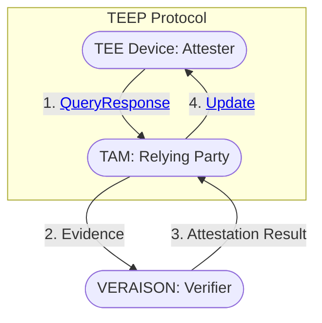

- [Secure Software Provisioning with TEEP \& VERAISON](#secure-software-provisioning-with-teep--veraison)
  - [Objectives](#objectives)
  - [Architecture](#architecture)
  - [How to Run](#how-to-run)

# Secure Software Provisioning with TEEP & VERAISON

This repository hosts running code and docs of the hackathon project at IETF124.

## Objectives
- Provides mature implementations of TEEP Protocol combined with SUIT Manifest Processor and RATS EAT & EAR
- Uses [VERAISON](https://github.com/veraison) as the background-check model Verifier for the Trusted Application Manager (TAM), enabling the TAM
  - to entrust VERAISON to verify the Evidence provided with QueryResponse message from TEEP Agent,
  - to authenticate all the TEEP messages from TEEP Agent with the key in confirmation claim (cnf) of the Attestation Result, and
  - to select appropriate Trusted Component(s) for the TEE Device to be installed and run

## Architecture

> [!TIP]
> You can click to jump the messages and the components.



The detailed sequence diagram and endpoints are documented respectively:
- [sequence diagram](./doc/SEQUENCE.md)
- [TAM endpoint](./doc/TAM.md)
- [VERAISON endpoints](./doc/VERAISON.md)

## How to Run

> [!NOTE]
> Tested in Ubuntu 22.04LTS

We recommend you to use Docker.

```sh
sudo apt install git docker.io jq docker-buildx
sudo usermod -a -G docker $USER

git clone --recursive https://github.com/kentakayama/ietf124
cd ietf124
make -C veraison/services docker-deploy
./veraison/services/end-to-end/end-to-end-docker provision

docker compose up -d
```
