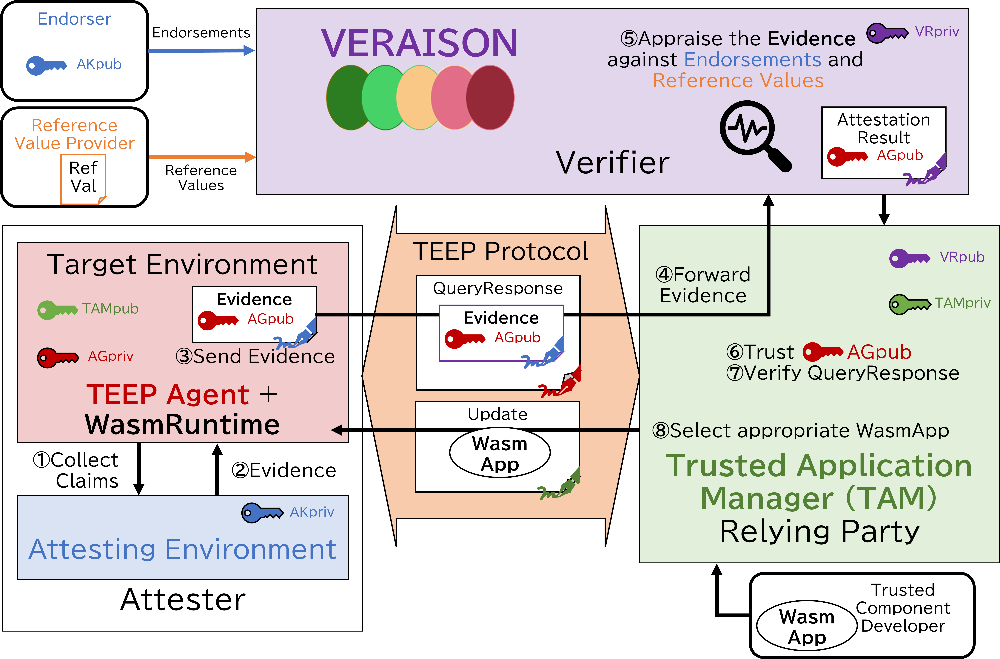

- [Secure Software Provisioning with TEEP \& VERAISON](#secure-software-provisioning-with-teep--veraison)
  - [Objectives](#objectives)
  - [Architecture](#architecture)
  - [How to Run](#how-to-run)
    - [Setup](#setup)
    - [Run VERAISON](#run-veraison)
    - [A. Provision TEE Device with Generic EAT Evidence](#a-provision-tee-device-with-generic-eat-evidence)
    - [B. Provision TEE Device with PSA Attestation Token](#b-provision-tee-device-with-psa-attestation-token)
    - [(Optional) Run Step by Step with TEEP Agent](#optional-run-step-by-step-with-teep-agent)
  - [Next Plan](#next-plan)

# Secure Software Provisioning with TEEP & VERAISON

This repository hosts running code and docs of the hackathon project at IETF124.

## Objectives

We set a goal of this project; **Run a WasmApp only on an attested WasmRuntime**

In order to aciheve this goal, we implemented programs as Running Code based on the TEEP and RATS documents
- to evaluate whether TEEP (TEE Provisioning) Protocol incorporating Remote Attestation is practically viable by using VERAISON as a Verifier
- to share feedback to the RATS documents and VERAISON from the perspective of TEEP utilizing RATS

## Outcomes

- We provide mature implementations of [TEEP Protocol](https://datatracker.ietf.org/doc/html/draft-ietf-teep-protocol) combined with [SUIT Manifest Processor](https://datatracker.ietf.org/doc/html/draft-ietf-suit-manifest), [RATS EAT](https://datatracker.ietf.org/doc/html/rfc9711), [EAT Measured Component](https://datatracker.ietf.org/doc/html/draft-ietf-rats-eat-measured-component) and [EAT Attestation Results (EAR)](https://datatracker.ietf.org/doc/html/draft-ietf-rats-ear)
- We've shared feedback on the TEEP and RATS mailing list based on the findings during hackathon

## Architecture



- [VERAISON](https://github.com/veraison) is used as the background-check model Verifier for the Trusted Application Manager (TAM), enabling the TAM
  - entrusting VERAISON to verify the Evidence provided with QueryResponse message from TEEP Agent,
  - authenticating all the TEEP messages from TEEP Agent with the key in confirmation claim (cnf) of the Attestation Result, and
  - choosing the appropriate Trusted Component (a WasmApp) for the TEE Device to be installed and run

## Exchanged Messages

> [!TIP]
> You can click to jump the messages and the components.


The details are explained here:
- [Architecture and Message flow](./doc/README.md)
- [TAM HTTP endpoint](./tam/README.md)
- [TEEP Agent (Attester) command line interfaces](./attester/README.md)
- [VERAISON](https://www.veraison-project.org/book/)

## How to Run

### Setup

For docker environment on Ubuntu, run these commands.
```sh
sudo apt install git docker.io jq docker-buildx
sudo usermod -a -G docker $USER
su - $USER # or re-login

git clone --recursive https://github.com/s-miyazawa/teep-wasm-demo
cd teep-wasm-demo/
make -C veraison/services docker-deploy
```

You can deploy VERAISON also in other environments, see [VERAISON deployments/docker](https://github.com/veraison/services/tree/main/deployments/docker).

### Run VERAISON

```sh
$ cd teep-wasm-demo/

# run and initialize VERAISON Verifier
$ source ./veraison/services/deployments/docker/env.bash
$ veraison start
$ veraison clear-stores
$ ./veraison/services/end-to-end/end-to-end-docker provision
$ curl -X POST --data-binary "@./testvector/prebuilt/corim-generic-eat-measurements.cbor" -H 'Content-Type: application/corim-unsigned+cbor; profile="http://example.com/corim/profile"' --insecure https://localhost:9443/endorsement-provisioning/v1/submit
```

### A. Provision TEE Device with Generic EAT Evidence

The term *Generic EAT* is our coined word, which implies that this verification scheme is designed to accept any EAT-based Evidence.
This is not intended for commercial use because it is not practical to verify too much flexible Evidence, but for reference implementation use for EAT-based protocol designers.

In this demo, the digest of the TEE environment is measured and stored using [EAT Measured Component](https://datatracker.ietf.org/doc/html/draft-ietf-rats-eat-measured-component), and it is compared with Reference Value.
In initial state, the digest is not actual one taken by the hardware-backed attester such as TPM, Intel SGX Quoting Enclave, etc.

When the TEEP Agent (in Target Environment inside the TEE) requests the Attesting Environment to create Evidence, it passes the its public key.
The Attesting Environment generates the Evidence which included measureent of the TEEP Agent and the WasmRuntime, as well as the public key of the TEEP Agent.
After the verification by VERAISON, the TAM can trust the public key and verify the message from the TEEP Agent.

```sh
$ docker compose up
```

> [!TIP]
> You can check the VERAISON logs with following command:
> `$ veraison logs && tail -n30 veraison-logs/*.log`

### B. Provision TEE Device with PSA Attestation Token

PSA Attestation Token is standardized with [RFC 9783](https://datatracker.ietf.org/doc/html/rfc9783), which is a profile of EAT carrying the Evidence of the Target Environment.
Since there is no room for key confirmation claim in the token, the TAM must have the pre-shared TEEP Agent's key.

```sh
$ TAM4WASM_CHALLENGE_CONTENT_TYPE=application/psa-attestation-token PROFILE=psa docker compose up
```

### (Optional) Run Step by Step with TEEP Agent

```sh
$ cd teep-wasm-demo/

# run TAM in background
$ docker compose up -d container_tam

# run and enter the TEEP HTTP Client container
$ docker compose up container_agent /bin/bash
```

In the contaienr terminal,

```sh
$ ls -la ./
[no files exists]

$ teep_wasm_get install app.wasm
[TEEP Broker] > POST http://container_tam:8080/tam {empty}
[TEEP Broker] < TEEP Received QueryRequest.
[TEEP Agent] parsed TEEP QueryRequest message
[TEEP Agent] generate EAT Evidence with challenge h'414A7C174141B3D0E9A1D28AF31520F0D42299FEAC4007DED89D68AE6CD92F19'
[TEEP Agent] generate QueryResponse with attestation-payload h'D28443A10126A05901D7A...'
[TEEP Broker] > POST http://container_tam:8080/tam {QueryResponse}
[TEEP Broker] < TEEP Update message
[TEEP Agent] parsed TEEP Update message
[TEEP Agent] process SUIT Manifest h'A2025873825824822F...'
[SUIT Manifest Processor] Store : to ['./manifest.app.wasm.0.suit']
[SUIT Manifest Processor] Store : to ['./app.wasm']
[TEEP Broker] > HTTP POST http://container_tam:8080/tam {Success}
[TEEP Broker] The TAM terminated the connection

$ ls -la ./
app.wasm
manifest.app.wasm.0.suit

$ iwasm app.wasm
Hello, world!
```

> [!TIP]
> You can check the background TAM output with following command:
> `$ docker compose logs container_tam`

## Next Plan

- Use real TEE such as Intel SGX, Intel TDX, AMD SEV, Arm TrustZone, combining with TPM, etc.
- Update the 

## Acknowledgement

This work was supported by JST K Program Grant Number JPMJKP24U4, Japan.
