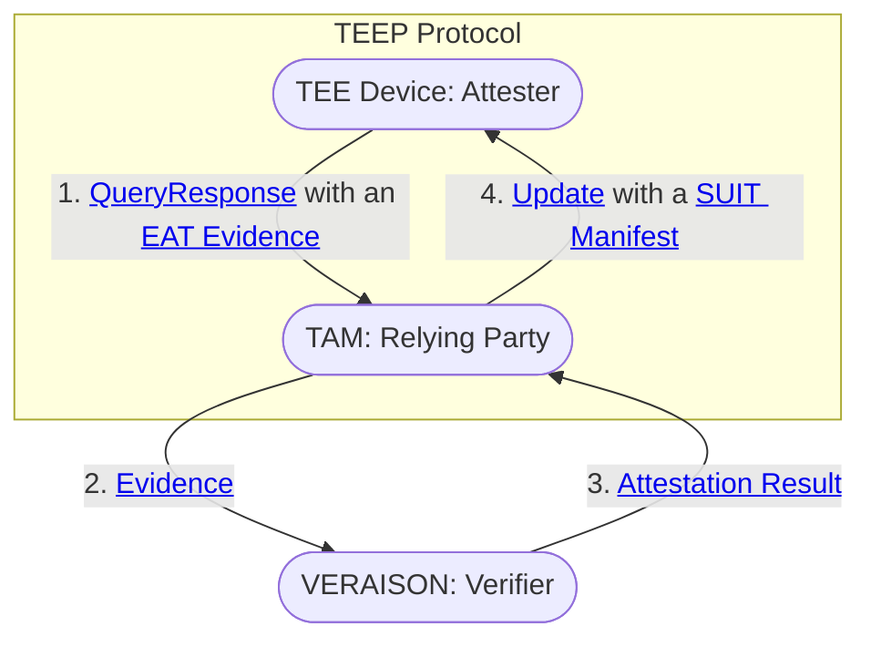

- [Secure Software Provisioning with TEEP \& VERAISON](#secure-software-provisioning-with-teep--veraison)
  - [Objectives](#objectives)
  - [Architecture](#architecture)
  - [How to Run](#how-to-run)
  - [Next Plan](#next-plan)

# Secure Software Provisioning with TEEP & VERAISON

This repository hosts running code and docs of the hackathon project at IETF124.

## Objectives
- Provides mature implementations of [TEEP Protocol](https://datatracker.ietf.org/doc/html/draft-ietf-teep-protocol) combined with [SUIT Manifest Processor](https://datatracker.ietf.org/doc/html/draft-ietf-suit-manifest) and [RATS EAT](https://datatracker.ietf.org/doc/html/rfc9711) & [EAR](https://datatracker.ietf.org/doc/html/draft-ietf-rats-ear) implementations
- Uses [VERAISON](https://github.com/veraison) as the background-check model Verifier for the Trusted Application Manager (TAM), enabling the TAM
  - to entrust VERAISON to verify the Evidence provided with QueryResponse message from TEEP Agent,
  - to authenticate all the TEEP messages from TEEP Agent with the key in confirmation claim (cnf) of the Attestation Result, and
  - to select appropriate Trusted Component(s) for the TEE Device to be installed and run

## Architecture

> [!TIP]
> You can click to jump the messages and the components.



The details are explained here:
- [Architecture and Message flow](./doc/README.md)
- [TAM HTTP endpoint](./doc/TAM.md)
- [VERAISON HTTP endpoints](./doc/VERAISON.md)

## How to Run

### Setup

For docker environment on Ubuntu, run these commands.
```sh
sudo apt install git docker.io jq docker-buildx
sudo usermod -a -G docker $USER
su - $USER # or re-login

git clone --recursive https://github.com/kentakayama/ietf124
cd ietf124/
make -C veraison/services docker-deploy
```

You can deploy VERAISON also in other environments, see [VERAISON deployments/docker](https://github.com/veraison/services/tree/main/deployments/docker).

### Run End-to-End Demo

```sh
cd ietf124/

# run and initialize VERAISON Verifier
source ./veraison/services/deployments/docker/env.bash
veraison start
./veraison/services/end-to-end/end-to-end-docker provision

# run TAM and the TEEP HTTP Client
docker compose up
```

### Run as an User

```
cd ietf124/

# run and initialize VERAISON verifier
source ./veraison/services/deployments/docker/env.bash
veraison start
./veraison/services/end-to-end/end-to-end-docker provision

# run TAM in background
docker compose up -d container_tam

# run and enter the TEEP HTTP Client container
docker compose up container_agent /bin/bash
```

In the contaienr terminal,

```sh
# ls -la ./
[no files exists]

# teep_wasm_get install app.wasm
[TEEP Broker] > POST http://container_tam:8080/tam {empty}
[TEEP Broker] < TEEP Message
[TEEP Agent] parsed TEEP QueryRequest message
[TEEP Agent] generate EAT Evidence with challenge h'414a7c174141b3d0e9a1d28af31520f0d42299feac4007ded89d68ae6cd92f19'
[TEEP Agent] generate QueryResponse with attestation-payload h'D28443A10126A05901D7A...'
[TEEP Broker] > POST http://container_tam:8080/tam [QueryResponse]
[TEEP Broker] < TEEP Message
[TEEP Agent] parsed TEEP Update message
[SUIT Manifest Processor] store: to ['app.wasm'] h'A2025873825824822F...'
[TEEP Broker] OK

# ls -la ./
app.wasm
manifest.app.wasm.0.suit

# iwasm app.wasm
Hello, World!
```

## Next Plan

- Use actual TEE
