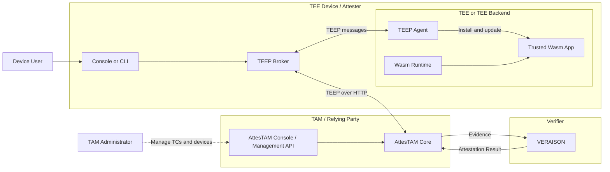

# IETF 126 TEEP Wasm Demo

This repository contains the code and documentation for the IETF 126 TEEP Wasm Demo. It explores secure Wasm application provisioning with TEEP and device trust establishment through RATS-based remote attestation.

The IETF 126 demo has two independent, complementary tracks. They share the same TEEP architecture and server-side components, but use different TEEP Agent implementations, user interfaces, workloads, and deployment environments.

## IETF 126 Highlights

- Run TAWS on Intel SGX hardware in an Azure virtual machine instead of SGX simulation mode.
- Introduce TWEP-SYSTEM, a second TEEP Agent implementation designed for portability across TEE platforms.

## Demo Tracks

### TAWS on an Azure VM with Intel SGX

TAWS is the first TEEP Agent implementation developed for this project. In this track, a building owner uses the TAWS Console to activate a device, install or update a YOLOv8 Wasm application through TEEP, and run object detection.

The IETF 125 demo ran TAWS in Intel SGX simulation mode. For IETF 126, TAWS is being deployed on an SGX-capable Azure VM so that TAWS and its Wasm workload run in an enclave on real SGX hardware.

The final documentation will distinguish hardware enclave execution from DCAP-based remote attestation and describe the Evidence format and VERAISON verification path actually demonstrated.

### TWEP-SYSTEM on NVIDIA Jetson with OP-TEE

TWEP-SYSTEM is the second TEEP Agent implementation. It provides a command-oriented environment for securely acquiring, updating, loading, and executing Trusted Wasm Apps through `twep-cli`.

For IETF 126, TWEP-SYSTEM is being deployed on an NVIDIA Jetson device using OP-TEE as the Trusted Execution Environment based on Arm TrustZone.

The TEEP Agent and Trusted Wasm Apps are implemented as Rust `no_std` Wasm applications. The same Wasm binaries are intended to run across different TEE platforms, while hostcalls and platform backends handle differences such as protected storage, Evidence generation, and runtime policy.

The initial development paths include Linux and OP-TEE/TrustZone. SGX, Keystone, and other TEEs are architecture targets and must not be interpreted as completed or security-validated ports.

TWEP-SYSTEM currently supports development integration with AttesTAM. End-to-end verified mode is still under development. Its source repository will be published under a public GitHub account.

## Common Architecture

```mermaid
flowchart LR
    User[Device User]
    TAMAdmin[TAM Administrator]

    subgraph Device[TEE Device / Attester]
        UI[Console or CLI]
        Broker[TEEP Broker]
        subgraph TEE[TEE or TEE Backend]
            Agent[TEEP Agent]
            Runtime[Wasm Runtime]
            App[Trusted Wasm App]
        end
    end

    subgraph TAM[TAM / Relying Party]
        Management[AttesTAM Console / Management API]
        AttesTAM[AttesTAM Core]
    end

    subgraph Verifier[Verifier]
        VERAISON[VERAISON]
    end

    User --> UI
    TAMAdmin -.->|Manage TCs and devices| Management
    Management --> AttesTAM
    UI --> Broker
    Broker <-->|TEEP over HTTP| AttesTAM
    Broker <-->|TEEP messages| Agent
    Agent -->|Install and update| App
    Runtime --> App
    AttesTAM -->|Evidence| VERAISON
    VERAISON -->|Attestation Result| AttesTAM
```

The common server-side components are:

- **AttesTAM Core**: the Trusted Application Manager and Relying Party
- **AttesTAM Console / Management API**: the management interface used by a TAM Administrator to register Trusted Components and manage devices
- **VERAISON**: the Verifier used during remote attestation

TAWS and TWEP-SYSTEM provide different device-side implementations of the TEEP Agent, TEEP Broker, Wasm runtime integration, and user interface. They are separate demonstrations of the common protocol architecture rather than interchangeable front ends for the same workload.

## Running the Demos

The complete setup and operation procedures will be maintained in the mdBook documentation because the two tracks have different prerequisites and workflows.

### TAWS Track

The IETF 126 instructions will cover Azure VM setup, SGX hardware verification, TAWS startup, browser access, Wasm application provisioning, Evidence inspection, and cleanup.

The previous SGX simulation demo remains available from the [`ietf125` tag](https://github.com/s-miyazawa/teep-wasm-demo/tree/ietf125).

### TWEP-SYSTEM Track

The IETF 126 instructions will cover NVIDIA Jetson and OP-TEE setup, the TWEP-SYSTEM build, `twepd` startup, `twep-cli` operations, AttesTAM integration, expected results, and cleanup. The documentation link will be added after the TWEP-SYSTEM repository is published.

## Repository Components

- `docker-compose.yaml`: launches the currently available TAWS and AttesTAM demo containers
- `AttesTAM`: the AttesTAM submodule
- `taws`: the TAWS submodule
- `veraison/services`: the local VERAISON deployment used for attestation
- `assets/manifest`: model manifests used by the TAWS track
- `assets/demo-images`: sample input images used by the TAWS detector
- `testvectors`: TEEP, SUIT, EAT, and SGX Quote3 test vectors

TWEP-SYSTEM will be added after its source repository is moved to a public GitHub account.

## Documentation

- [Introduction](./doc/introduction.md)
- [Background](./doc/background.md)
- [Scenario](./doc/scenario.md)
- [Links to subsystem documentation](./doc/link.md)
- [Terminology](./doc/terminology.md)
- [AttesTAM documentation](https://github.com/kentakayama/AttesTAM)
- [TAWS documentation](https://github.com/yuma-nishi/taws)

The mdBook will be expanded with separate setup and operation pages for the TAWS and TWEP-SYSTEM tracks.

## Acknowledgments

This work was supported by JST K Program Grant Number JPMJKP24U4, Japan.
