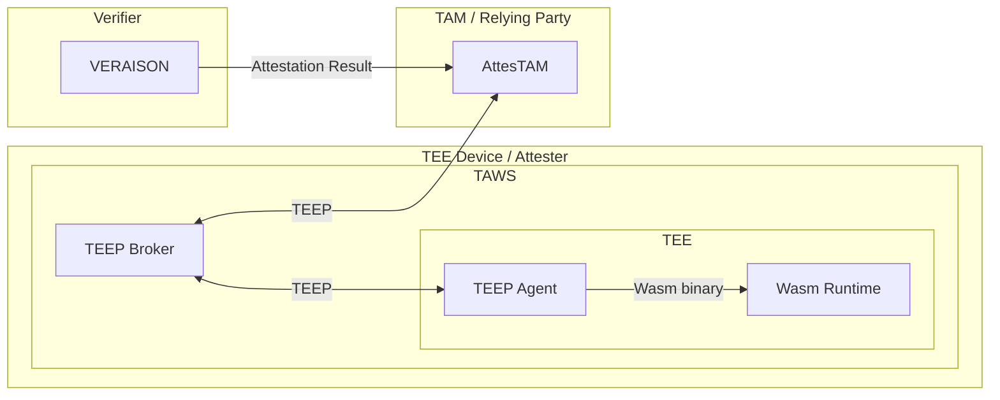

# Secure Wasm Application Provisioning with TEEP & RATS

This repository contains the code and documentation for the IETF 125 hackathon demo.

The goals of this project are:

- **To establish trust in the TEEP Agent's public key via Remote Attestation**
- To implement the Trusted Component to run on a Wasm runtime so that it can support multiple CPU architectures
- To help users understand the intended usage by providing actual applications and consoles

See [doc/introduction.md](./doc/introduction.md) for detailed information.

## Architecture


```mermaid
flowchart LR

    subgraph Device["TEE Device / Attester"]
      subgraph TAWS["TAWS"]
        REE[TEEP Broker]
        subgraph TEE["TEE"]
            Agent[TEEP Agent]
            WAMR[Wasm Runtime]
        end
      end
    end

    subgraph Verifier["Verifier"]
        VERAISON[VERAISON]
    end

    subgraph TAM["TAM / Relying Party"]
        AttesTAM[AttesTAM]
    end

    REE <-->|TEEP| Agent
    REE <-->|TEEP| AttesTAM
    Agent -->|Wasm binary| WAMR
    VERAISON -->|Attestation Result| AttesTAM
```
- TAWS Console image

- AttesTAM Console image


## Quick Start

### Test Environment

- CPU: Intel (required)
- OS: Ubuntu 24.04
- Container runtime: Docker

### Setup Overview

- Clone this repository
```sh
git clone --recursive https://github.com/s-miyazawa/teep-wasm-demo.git
```
- Build and provision
```sh
cd teep-wasm-demo/
./taws/scripts/prepare_sgx_base_image.sh
make -C veraison/services docker-deploy
source deployments/docker/env.bash
veraison start
docker compose build
curl -X POST --data-binary "@./testvectors/prebuilt/corim-generic-eat-measurements.cbor" -H 'Content-Type: application/corim-unsigned+cbor; profile="http://example.com/corim/profile"' --insecure https://localhost:9443/endorsement-provisioning/v1/submit
```
- Start the demo
```sh
docker compose up
```
- Open the TAWS and AttesTAM consoles in a browser.
  - TAWS Console: http://127.0.0.1:8181
  - AttesTAM Console: http://127.0.0.1:9090

See [doc/scenario.md](./doc/scenario.md) for how to run the demo scenario.

## Documentation

Start here for the overview, then move into `doc/` for details:

- [Introduction](./doc/introduction.md)
- [Background](./doc/background.md)
- [Scenario](./doc/scenario.md)
- [Links to Subsystem Documentation](./doc/link.md)
- [Terminology](./doc/terminology.md)

## Acknowledgments

This work was supported by JST K Program Grant Number JPMJKP24U4, Japan.
