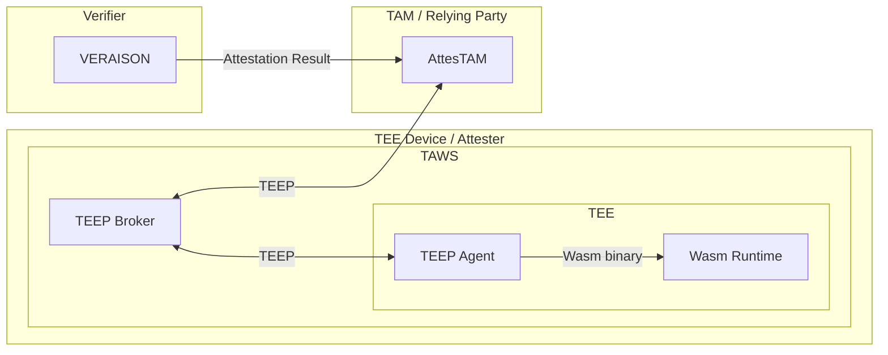
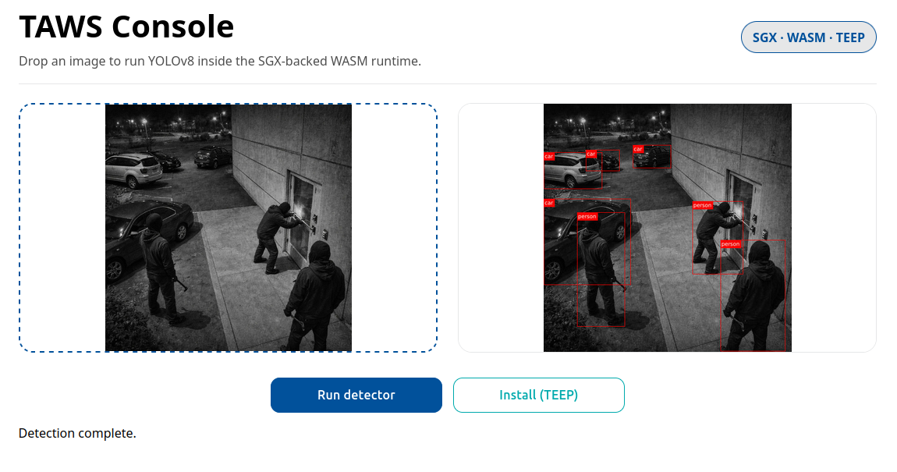
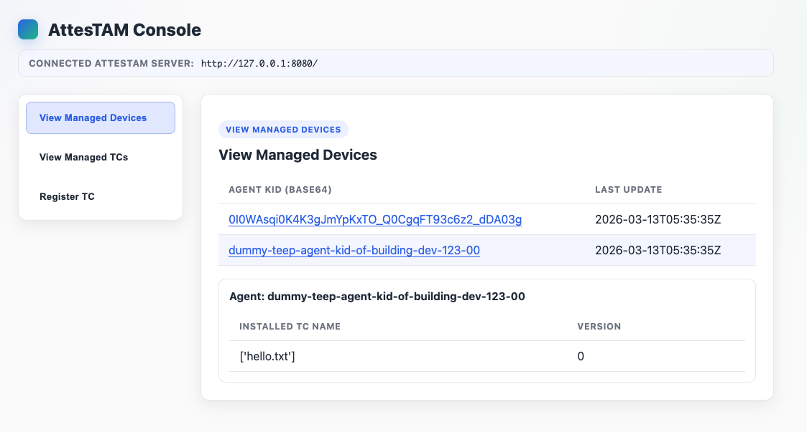

# Secure Wasm Application Provisioning with TEEP and RATS

This repository contains the code and documentation for a demo that provisions a Wasm application to a TEE device using TEEP, with **device trust established through RATS-based remote attestation**.

The demo is built from three runtime components:

- `TAWS`: the TEEP Agent and web console running the Wasm workload in Intel SGX simulation mode
- `AttesTAM`: the Trusted Application Manager and administrator console
- `VERAISON`: the Verifier used during attestation

For the full background and use case, start with [doc/introduction.md](./doc/introduction.md).

## Architecture


```mermaid
flowchart LR

    subgraph Device["TEE Device / Attester"]
      subgraph TAWS["TAWS"]
        REE[TEEP Broker]
        subgraph TEE["TEE"]
            Agent[TEEP Agent]
            WAMR[Wasm Runtime]
        end
      end
    end

    subgraph Verifier["Verifier"]
        VERAISON[VERAISON]
    end

    subgraph TAM["TAM / Relying Party"]
        AttesTAM[AttesTAM]
    end

    REE <-->|TEEP| Agent
    REE <-->|TEEP| AttesTAM
    Agent -->|Wasm binary| WAMR
    VERAISON -->|Attestation Result| AttesTAM
```

TAWS Console:


AttesTAM Console:


## Components

- `docker-compose.yaml`: launches the demo containers for `TAWS` and `AttesTAM`
- `veraison/services`: builds and runs the local VERAISON deployment used for attestation
- `taws/scripts/prepare_sgx_base_image.sh`: prepares the SGX SDK base image required by the TAWS Docker build
- `assets/manifest`: contains the model manifests uploaded from the AttesTAM Console during the demo
- `assets/demo-images`: contains the sample input image used by the detector demo
- `testvectors/prebuilt`: contains the prebuilt CoRIM binary used to provision VERAISON

## Prerequisites

The documented flow has been tested on:

- CPU: Intel
- OS: Ubuntu 24.04
- Container runtime: Docker Engine with Buildx
- Shell: `bash`

Install the required packages:

```sh
sudo apt install bash make git docker.io docker-buildx jq
sudo systemctl enable --now docker
sudo usermod -a -G docker "$USER"
newgrp docker
```

> [!IMPORTANT]
> Use the native Ubuntu `docker.io` package, not the Snap package.

## Quick Start

### 1. Clone the repository

```sh
git clone --recursive https://github.com/s-miyazawa/teep-wasm-demo
cd teep-wasm-demo
```

### 2. Build and start VERAISON

This prepares the Verifier deployment and starts its containers.

```sh
make -C veraison/services docker-deploy
source ./veraison/services/deployments/docker/env.bash
veraison status
```

### 3. Prepare the TAWS SGX base image

This downloads Intel SGX build dependencies and creates the `sgx_sample_deb` image used by the TAWS Docker build.

```sh
./taws/scripts/prepare_sgx_base_image.sh
```

### 4. Build the demo containers

```sh
docker compose build
```

> [!NOTE]
> Initial setup can take 10 minutes or more because VERAISON, SGX dependencies, and the demo containers are all built locally.

### 5. Provision VERAISON endorsements

This uploads the prebuilt CoRIM used by the attestation flow from `testvectors/prebuilt`.

```sh
curl -X POST \
  --data-binary "@./testvectors/prebuilt/corim-generic-eat-measurements.cbor" \
  -H 'Content-Type: application/corim-unsigned+cbor; profile="http://example.com/corim/profile"' \
  --insecure \
  https://localhost:9443/endorsement-provisioning/v1/submit
```

### 6. Start the demo services

This starts `AttesTAM` and `TAWS`.

```sh
docker compose up
```

Leave this command running while you use the web consoles.

### 7. Install the initial model

1. Open the AttesTAM Console at `http://localhost:9090`.
2. Click `Register TC`, choose `assets/manifest/yolov8.wasm.0.envelope.cbor`, and click `Upload`.
3. Confirm the console shows `Upload complete.`.
4. Open the TAWS Console at `http://localhost:8181`.
5. Click `Activate (TEEP)` to establish trust in the TEEP Agent key through attestation.
6. Click `Install (TEEP)` to download and install `yolov8.wasm`.
7. Upload or drag in the sample image [`assets/demo-images/surveillance.jpg`](./assets/demo-images/surveillance.jpg).
8. Click `Run detector`. This may take 10 seconds or more.

### 8. Update the model

1. Return to the AttesTAM Console.
2. Upload `assets/manifest/yolov8.wasm.1.envelope.cbor`.
3. Confirm the upload completes successfully.
4. Return to the TAWS Console.
5. Click `Install (TEEP)` again to install the newer model version.
6. Run the detector again with the same sample image. This may take 10 seconds or more.

For the complete end-to-end story and expected results, see [doc/scenario.md](./doc/scenario.md).

### 9. Terminate

You can confirm that docker containers are running.

```sh
$ docker ps --format "{{.Image}}"
teep-wasm-demo-container_attester
teep-wasm-demo-container_tam
veraison/management
veraison/verification
veraison/provisioning
veraison/vts
veraison/keycloak
```

Then, terminate Demo and VERAISON containers with:

```sh
docker compose down

veraison stop
veraison clear-stores # optional
```

You can confirm that docker containers are not running.

```sh
$ docker ps
CONTAINER ID   IMAGE     COMMAND   CREATED   STATUS    PORTS     NAMES
```

## Next Plan

- Use Intel SGX Enclave with real hardware to use DCAP Remote Attestation
- Propose a plugin interface for customizable Attestation Results to VERAISON, e.g. JSON/CBOR output, JWT/CWT signing key, additional claims, etc.

## More Documentation

- [Introduction](./doc/introduction.md)
- [Background](./doc/background.md)
- [Scenario](./doc/scenario.md)
- [Links to subsystem documentation](./doc/link.md)
- [Terminology](./doc/terminology.md)
- [AttesTAM documentation](./AttesTAM/README.md)
- [TAWS documentation](./taws/README.md)

## Acknowledgments

This work was supported by JST K Program Grant Number JPMJKP24U4, Japan.
