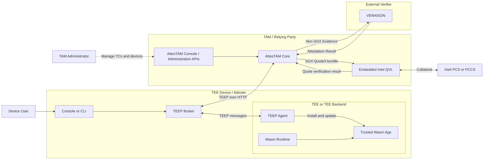

# IETF 126 TEEP Wasm Demo

This repository contains the code and documentation for the IETF 126 TEEP Wasm Demo. It explores secure Wasm application provisioning with TEEP and device trust establishment through RATS-based remote attestation.

The IETF 126 demo has two independent, complementary tracks. They share the same TEEP architecture and AttesTAM server, but use different TEEP Agent implementations, verifier backends, user interfaces, workloads, and deployment environments.

## IETF 126 Highlights

- Run TAWS on Intel SGX hardware in an Azure virtual machine instead of SGX simulation mode.
- Introduce TWEP-SYSTEM, a second TEEP Agent implementation designed for portability across TEE platforms.

## Demo Tracks

### TAWS on an Azure VM with Intel SGX

TAWS is the first TEEP Agent implementation developed for this project. In this track, a building owner uses the TAWS Console to activate a device, install or update a YOLOv8 Wasm application through TEEP, and run object detection.

The IETF 125 demo ran TAWS in Intel SGX simulation mode. For IETF 126, TAWS is being deployed on an SGX-capable Azure VM so that TAWS and its Wasm workload run in an enclave on real SGX hardware.

TAWS implements SGX DCAP Evidence generation by default. AttesTAM selects its embedded Intel QVL backend for the resulting SGX Quote3 TEEP bundle; other Evidence formats are routed to an external VERAISON verifier. The final documentation records hardware enclave execution, Evidence generation, Quote verification, and the resulting AttesTAM trust decision as separate results.

### TWEP-SYSTEM on NVIDIA Jetson with OP-TEE

TWEP-SYSTEM is the second TEEP Agent implementation. It provides a command-oriented environment for securely acquiring, updating, loading, and executing Trusted Wasm Apps through `twep-cli`.

For IETF 126, TWEP-SYSTEM runs on a Jetson Orin Nano Super Developer Kit using OP-TEE as the Trusted Execution Environment based on Arm TrustZone. The direct TA smoke path, public C ABI path, and normal `twep-cli` / resident `twepd` path have been exercised on the Jetson hardware. HelloWorld, CalcAdd, and NegaPosi execute through the TrustZone backend and TA-local WAMR.

The TEEP Agent and Trusted Wasm Apps are implemented as Rust `no_std` Wasm applications. The same Wasm binaries are intended to run across different TEE platforms, while hostcalls and platform backends handle differences such as protected storage, Evidence generation, and runtime policy.

The initial development paths include Linux and OP-TEE/TrustZone. SGX, Keystone, and other TEEs are architecture targets and must not be interpreted as completed or security-validated ports.

The IETF 126 demo resets the Jetson state, connects `twep-cli` to a resident `twepd`, and uses an alternate unregistered demo Agent key to force AttesTAM's challenge-response path. The Wasm TEEP Agent constructs Generic EAT Evidence, the OP-TEE TA supplies ES256 signing, and external VERAISON returns an `affirming` result before AttesTAM distributes the requested Wasm Trusted Component.

This is a fixture-backed development demonstration: it uses AttesTAM insecure demo mode, development Agent and attester keys, fixed Generic EAT claims, and a matching CoRIM fixture. It demonstrates the protocol and verifier integration, but it is not the production-grade final verified mode. Device-specific identity claims, production key provisioning, verifier policy, protected trust anchors, and final Catalog/application promotion policy remain in progress. The source repository will be published under a public GitHub account.

## Common Architecture

```mermaid
flowchart LR
    User[Device User]
    TAMAdmin[TAM Administrator]

    subgraph Device[TEE Device / Attester]
        UI[Console or CLI]
        Broker[TEEP Broker]
        subgraph TEE[TEE or TEE Backend]
            Agent[TEEP Agent]
            Runtime[Wasm Runtime]
            App[Trusted Wasm App]
        end
    end

    subgraph TAM[TAM / Relying Party]
        Management[AttesTAM Console / Administration APIs]
        AttesTAM[AttesTAM Core]
        QVL[Embedded Intel QVL]
    end

    subgraph ExternalVerifier[External Verifier]
        VERAISON[VERAISON]
    end

    PCS[Intel PCS or PCCS]

    User --> UI
    TAMAdmin -.->|Manage TCs and devices| Management
    Management --> AttesTAM
    UI --> Broker
    Broker <-->|TEEP over HTTP| AttesTAM
    Broker <-->|TEEP messages| Agent
    Agent -->|Install and update| App
    Runtime --> App
    AttesTAM -->|Non-SGX Evidence| VERAISON
    VERAISON -->|Attestation Result| AttesTAM
    AttesTAM -->|SGX Quote3 bundle| QVL
    QVL -->|Quote verification result| AttesTAM
    QVL <-->|Collateral| PCS
```

The common server-side components are:

- **AttesTAM Core**: the Trusted Application Manager and Relying Party
- **AttesTAM Console / Administration APIs**: the Console BFF and the SUIT Manifest Service and TEEP Agent Service APIs used to register Trusted Components and inspect managed devices
- **Embedded Intel QVL**: the experimental AttesTAM-local verifier backend selected for `application/sgx-quote3-teep-bundle`
- **VERAISON**: the external verifier used for non-SGX Evidence formats

The current AttesTAM Console does not authenticate or authorize Console users. Expose it only through a controlled local route or tunnel in demo environments.

TAWS and TWEP-SYSTEM provide different device-side implementations of the TEEP Agent, TEEP Broker, Wasm runtime integration, and user interface. They are separate demonstrations of the common protocol architecture rather than interchangeable front ends for the same workload.

## Running the Demos

The complete setup and operation procedures will be maintained in the mdBook documentation because the two tracks have different prerequisites and workflows.

### TAWS Track

The [IETF 126 TAWS instructions](./doc/demos/taws-azure.md) cover the Azure Docker and native builds documented by TAWS, SGX device verification, TAWS startup, browser access, Wasm application provisioning, DCAP Evidence inspection, and cleanup.

The previous SGX simulation demo remains available from the [`ietf125` tag](https://github.com/s-miyazawa/teep-wasm-demo/tree/ietf125).

### TWEP-SYSTEM Track

The [IETF 126 TWEP-SYSTEM instructions](./doc/demos/twep-jetson.md) cover the validated Jetson demo flow: deploying the current build, resetting AttesTAM and Jetson state, provisioning the Generic EAT fixture, registering Wasm Trusted Components, operating the resident daemon, observing AttesTAM and VERAISON, and running HelloWorld and CalcAdd.

## Repository Components

- `docker-compose.yaml`: contains the existing TAWS and AttesTAM integration topology; the Azure SGX hardware workflow is documented separately in mdBook
- `AttesTAM`: the AttesTAM submodule
- `taws`: the TAWS submodule
- `veraison/services`: the local external VERAISON deployment used for non-SGX attestation formats
- `assets/manifest`: model manifests used by the TAWS track
- `assets/demo-images`: sample input images used by the TAWS detector
- `testvectors`: TEEP, SUIT, EAT, and SGX Quote3 test vectors

TWEP-SYSTEM will be added after its source repository is moved to a public GitHub account.

## Documentation

- [Introduction](./doc/introduction.md)
- [What Is New for IETF 126](./doc/ietf126.md)
- [Background](./doc/background.md)
- [Common Architecture](./doc/architecture.md)
- [TEEP Agent Implementations](./doc/implementations.md)
- [Running the Demos](./doc/scenario.md)
- [Implementation Status](./doc/status.md)
- [Links to subsystem documentation](./doc/link.md)
- [Terminology](./doc/terminology.md)
- [AttesTAM documentation](https://github.com/kentakayama/AttesTAM)
- [TAWS documentation](https://github.com/yuma-nishi/taws)

The mdBook contains separate setup and operation pages for the TAWS and TWEP-SYSTEM tracks. Each page distinguishes validated demo commands from remaining production or final-verification work.

## Acknowledgments

This work was supported by JST K Program Grant Number JPMJKP24U4, Japan.
