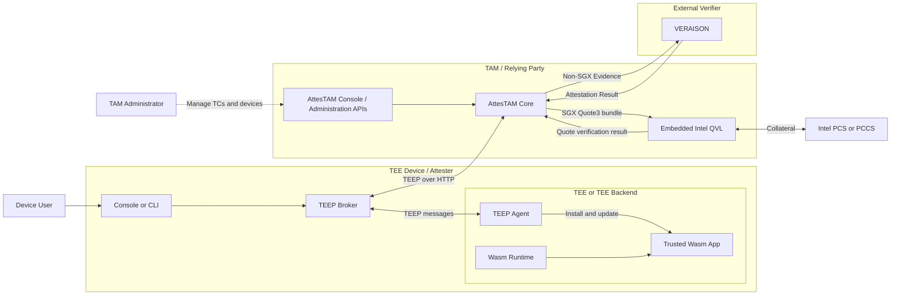

# IETF 126 TEEP Wasm Demo

This repository contains the code and documentation for the IETF 126 TEEP Wasm Demo. It demonstrates secure Wasm application provisioning with TEEP and device trust establishment through RATS-based remote attestation.

The demo has two independent, complementary tracks. Both use AttesTAM, but differ in their TEEP Agent implementation, user interface, workload, verifier backend, and deployment environment.

## IETF 126 Highlights

- Run TAWS on Intel SGX hardware in an Azure virtual machine instead of SGX simulation mode.
- Introduce TWEP-SYSTEM, a second TEEP Agent implementation designed for portability across TEE platforms.

## Demo Tracks

### TAWS on an Azure VM with Intel SGX

TAWS is the first TEEP Agent implementation developed for this project. A building owner uses its browser Console to activate a device, provision a YOLOv8 Wasm application through TEEP, and run object detection.

For IETF 126, TAWS and its Wasm workload ran in an SGX hardware enclave on an Azure VM. TAWS generated an SGX Quote3 TEEP bundle, and AttesTAM's embedded Intel QVL backend verified the Quote, challenge, and TEEP Agent key binding. The earlier SGX simulation demo is preserved in the [`ietf125` tag](https://github.com/s-miyazawa/teep-wasm-demo/tree/ietf125).

### TWEP-SYSTEM on NVIDIA Jetson with OP-TEE

TWEP-SYSTEM is the second TEEP Agent implementation, designed to keep the TEEP Agent and Trusted Wasm Apps portable across TEE platforms. For IETF 126, it runs on an NVIDIA Jetson Orin Nano Super Developer Kit with OP-TEE and executes HelloWorld, CalcAdd, and NegaPosi through `twep-cli` and a resident `twepd`.

The demonstrated attestation flow uses development keys and Generic EAT fixtures with AttesTAM and VERAISON. Production-grade device identity and key provisioning, as well as ports to SGX, Keystone, and other TEE architectures, remain future work.

## Common Architecture

```mermaid
flowchart LR
    User[Device User]
    TAMAdmin[TAM Administrator]

    subgraph Device[TEE Device / Attester]
        UI[Console or CLI]
        Broker[TEEP Broker]
        subgraph TEE[TEE or TEE Backend]
            Agent[TEEP Agent]
            Runtime[Wasm Runtime]
            App[Trusted Wasm App]
        end
    end

    subgraph TAM[TAM / Relying Party]
        Management[AttesTAM Console / Administration APIs]
        AttesTAM[AttesTAM Core]
        QVL[Embedded Intel QVL]
    end

    subgraph ExternalVerifier[External Verifier]
        VERAISON[VERAISON]
    end

    PCS[Intel PCS or PCCS]

    User --> UI
    TAMAdmin -.->|Manage TCs and devices| Management
    Management --> AttesTAM
    UI --> Broker
    Broker <-->|TEEP over HTTP| AttesTAM
    Broker <-->|TEEP messages| Agent
    Agent -->|Install and update| App
    Runtime --> App
    AttesTAM -->|Non-SGX Evidence| VERAISON
    VERAISON -->|Attestation Result| AttesTAM
    AttesTAM -->|SGX Quote3 bundle| QVL
    QVL -->|Quote verification result| AttesTAM
    QVL <-->|Collateral| PCS
```

AttesTAM acts as the TAM and Relying Party. It uses its embedded Intel QVL backend for the TAWS SGX Quote3 bundle and external VERAISON for other Evidence formats. TAWS and TWEP-SYSTEM provide separate device-side implementations of the common protocol architecture.

The current AttesTAM Console does not authenticate or authorize users. In demo environments, expose it only through a controlled local route or tunnel.

## Running the Demos

The two tracks have different prerequisites and workflows. Follow their separate mdBook pages:

- [TAWS on an Azure VM with Intel SGX](./doc/demos/taws-azure.md)
- [TWEP-SYSTEM on NVIDIA Jetson with OP-TEE](./doc/demos/twep-jetson.md)

## Repository Components

- `docker-compose.yaml`: TAWS and AttesTAM integration topology
- [`AttesTAM`](https://github.com/kentakayama/AttesTAM): the AttesTAM submodule
- [`taws`](https://github.com/yuma-nishi/taws): the TAWS submodule
- [`twep-system`](https://github.com/s-miyazawa/twep-system): the TWEP-SYSTEM submodule, currently pinned from the `docs/jetson-twep-demo-setup` branch
- `veraison/services`: the local external VERAISON deployment
- `assets`: manifests and demo inputs
- `testvectors`: TEEP, SUIT, EAT, and SGX Quote3 test vectors

## Documentation

- [Introduction](./doc/introduction.md)
- [What is new for IETF 126](./doc/ietf126.md)
- [Common architecture](./doc/architecture.md)
- [TEEP Agent implementations](./doc/implementations.md)
- [Demo procedures](./doc/scenario.md)
- [Implementation status](./doc/status.md)
- [Terminology](./doc/terminology.md)
- [Subsystem documentation](./doc/link.md)
- [AttesTAM documentation](https://github.com/kentakayama/AttesTAM)
- [TAWS documentation](https://github.com/yuma-nishi/taws)

The mdBook distinguishes validated demo procedures from remaining production and final-verification work.

## Acknowledgments

This work was supported by JST K Program Grant Number JPMJKP24U4, Japan.
