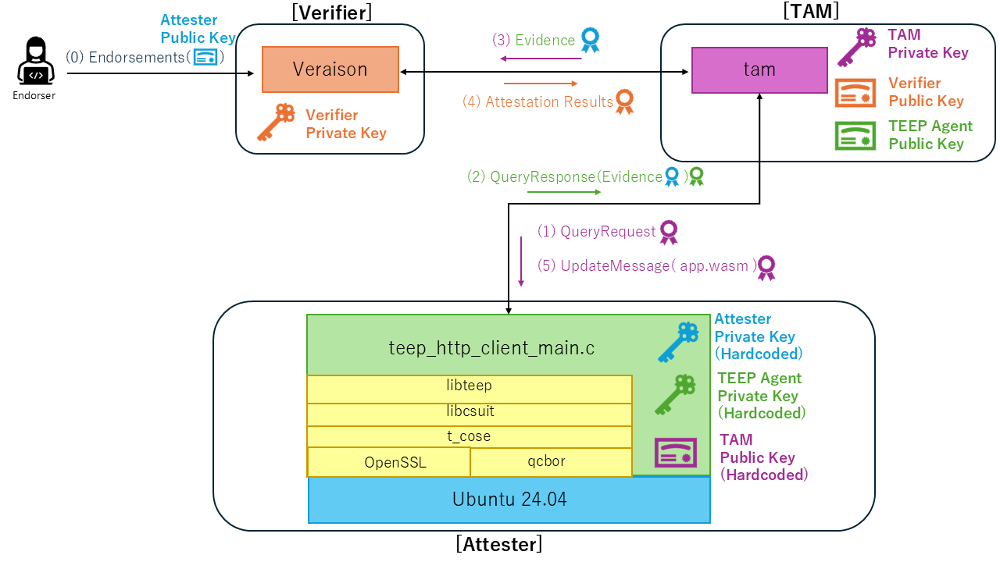

# ietf124-teep-attester 

This repository hosts the Attester implementation used in the TEEP demo planned for IETF 124. 
The TAM and Verifier components live in separate repositories; here we focus on building and running the Attester (teep_wasm_get). 
By combining this Attester with the matching TAM, you can replay the full TEEP provisioning

Notes: This sample does not currently run inside a Trusted Execution Environment. Enabling a real TEE integration (e.g., OP-TEE, Intel SGX) remains future work.

## Architecture



## Directory Structure

````
📁 ietf124-teep-attester 
├── 📁 third_party (TEEP dependencies tracked as git submodules)
│   ├── 📁 libcsuit
│   ├── 📁 libteep 
│   ├── 📁 QCBOR 
│   ├── 📁 t_cose 
├── 📁 src (attester sources)
└── 📁 bin (build output directory created after running make)
└── 📁 tests (CBOR fixtures and the TAM mock server utilities)
````

TEEP Attester uses the following libraries.
* [libcsuit](https://github.com/kentakayama/libcsuit)
* [libteep](https://github.com/kentakayama/libteep)
* [QCBOR](https://github.com/laurencelundblade/QCBOR)
* [t_cose](https://github.com/laurencelundblade/t_cose)


## Getting started

### Prerequisites

- Docker is required for the sample build flow (See [README](../README.md)).


### Run TAM Mock Server
- The TAM mock server listens on port 8080 and serves `app.wasm`. Start it before running the attester client so the binary can fetch the application payload.

```
host$ cd tests
host$ ./tam_server.sh
```
- Stop the mock server with `Ctrl+C` when finished.


### Attester Client
- After launching the TAM mock server, run `teep_wasm_get install app.wasm` from the attester directory so the binary fetches `app.wasm` from the mock endpoint.

```
host$ docker build -t teep-attester .
host$ docker run -it teep-attester:latest bash

(container)$ ls -la # nothing appears
(container)$ teep_wasm_get install app.wasm -u http://172.17.0.1:8080/tam
(container)$ ls -la # appears "app.wasm" and "manifest.app.wasm.0.suit"
(container)$ iwasm app.wasm 
```


## Running & CLI Options
- After building the attester (see the [Attester Client section](#attester-client)), you can use the `teep_wasm_get` command located in `/usr/bin/` to install the application.


```
Usage: ./teep_wasm_get install <application_name> [--tam-url <url>]
```

- `install`: Current supported mode that requests the TAM to provision the selected application.
- `<application_name>`: File or manifest seed located according to your TAM configuration.
- `--url <url>` / `-u <url>`: Override TAM base URL when connecting. Default is `http://localhost:8080/tam`.
- `TAM_URL`: Environment variable that also sets the TAM base URL; the CLI flag takes priority when both are provided.
