- [Detailed Explanation of this Hackathon Demo](#detailed-explanation-of-this-hackathon-demo)
  - [Situation](#situation)
  - [Message flow](#message-flow)
  - [Components](#components)
  - [Questions](#questions)
    - [Q. What kind of the cryptographic keys are used?](#q-what-kind-of-the-cryptographic-keys-are-used)
    - [Q. Why the TAM can trust the public key of the TEEP Agent?](#q-why-the-tam-can-trust-the-public-key-of-the-teep-agent)
    - [Q. What is TEEP Broker?](#q-what-is-teep-broker)

# Detailed Explanation of this Hackathon Demo

## Situation

## Message flow

```mermaid
sequenceDiagram
actor User
participant Broker as TEEP Broker
participant Agent as TEEP Agent
participant SMProcessor as SUIT Manifest Processor
participant TAM
actor Developer as TC Developer
participant Verifier
actor Endorser
actor PVProvider as Reference Value Provider

par Verifier Provisioning 
Endorser ->> Verifier: Certificate for verifying Evidence
PVProvider ->> Verifier: Valid {HWMODEL, MEASUREMENT, ...}
and TAM Provisioning
Developer ->> TAM: SUIT Manifest with `CONDITION`
end

User ->> Broker: request ['app.wasm']
Broker ->> Agent: RequestTA(['app.wasm'])
note over Agent: search for the TA but not found
Agent ->> Broker: getQueryRequest()
Broker ->> TAM: send("tam.example.com", "POST /init ")
TAM -->> Broker: SignedQueryRequest = COSE_Sign1(tamPrivKey, QueryRequest)
Broker ->> Agent: ProcessTeepMessage(SignedQueryRequest)
note over Agent: verify QueryRequest with tamPubKey<br/>generate EAT = COSE_Sign1(attesterPrivKey, claims)<br/>generate SignedQueryResponse = COSE_Sign1(agentKey, QueryResponse)
Agent ->> Broker: getUpdate(SignedQueryResponse)
Broker ->> TAM: send("tam.example.com", "POST /query_response {SignedQueryResponse}")
note over TAM: failed to verify the SignedQueryResponse<br/>because no trusted agentPubKey is found<br/>(pending on trusting the SignedQueryResponse)<br/>extract EAT Evidence from attestation-payload in untrusted SignedQueryResponse
TAM ->> Verifier: EAT Evidence
note over Verifier: Appraise Evidence
Verifier -->> TAM: EAT Attestation Results
note over TAM: verify Attestation Results<br/>retrieve agentPubKey from cnf claim<br/>verify SignedQueryResponse with agentPubKey<br/>determine which SUIT Manifest should be sent<br/>generate SignedUpdate = COSE_Sign1(tamPrivKey, Update)
TAM ->> Broker: SignedUpdate
Broker ->> Agent: ProcessTeepMessage(SignedUpdate)
note over Agent: verify SignedUpdate<br/>retrieve manifest
Agent ->> SMProcessor: ProcessSuitManifest(manifest)
SMProcessor ->> Broker: store(['app.wasm'], h'{content of app.wasm}')
Broker -->> SMProcessor: OK
SMProcessor -->> Agent: OK
Agent -->> Broker: OK
Broker -->> User: OK
note over User: iwasm ['app.wasm']
```

- Pre-shared Configurations (hardly coded or stored in each components)
    - The TEEP Agent in the Attester holds public keys of the TAM's and the Trusted Component Signer
    - The TAM holds the public key of Verifier, VERAISON
- Provisioning
    - The Endorser and the Reference Value Provider provides the Verifier Endorsements and Reference Values with CoRIM, such as public key of the Attester, golden value of measurements
    - The Trusted Component Signer creates a SUIT Manifest with `['app.wasm']` binary
- The User wants to run `app.wasm`, which will be provided by a TAM (Trusted Application Manager)
    - executes a request command triggering the TEEP Broker and the TEEP Agent
- The TEEP Agent POSTs an empty message to the TAM HTTP endpoint (defined [here](https://datatracker.ietf.org/doc/html/draft-ietf-teep-otrp-over-http-09#section-6.2))
    - indicating that the TEEP Agent wants get QueryRequest from the TAM
- The TAM sends TEEP QueryRequest as HTTP POST response
    - The value of `challenge` should be used generate EAT Evidence, stored in the `eat_nonce` claim
    - The QueryRequest message is signed by the TAM usign `COSE_Sign1` (see [RFC 9052](https://datatracker.ietf.org/doc/html/rfc9052) for detail), `ESP256` (ECDSA with SHA-256 and P-256 curve, see [IANA COSE](https://www.iana.org/assignments/cose/cose.xhtml))
- The TEEP Agent handles the signed QueryRequest
    - verifying the `COSE_Sign1` message with the TAM's public key
    - generating a signed [EAT Evidence](https://datatracker.ietf.org/doc/html/rfc9711) with the private key of Attester (already provisioned to the Verifier)
    - constituting a signed QueryResponse with the Evidence, and
    - sending it back to the TAM
- The TAM handles the signed QueryResponse
    - parsing the QueryResponse and extracting the Evidence
    - querying the Verifier to verify the Evidence
- The Verifier verifies the Evidence:
    - the signature of it with the public key in the Endorsements
    - the `measurements` value of EAT claims against the Reference Values using `oemid`, `ueid`, ... as a key to search it
    - generating an [EAT Attestation Results](https://datatracker.ietf.org/doc/html/draft-ietf-rats-ear) compatible with the [EAT Profile of TEEP Protocol](https://datatracker.ietf.org/doc/html/draft-ietf-teep-protocol#name-eat-profile)
- The TAM verifies the Attestation Results
    - verifying the `COSE_Sign1` Attestation Results with the Verifier's public key
    - extracting the `cnf` (key confirmation) claim, which holds the public key of TEEP Agent, and trust it
- The TAM resumes to handle the signed QueryResponse message
    - verifying the `COSE_Sign1` QueryResponse message with the TEEP Agent's public key
    - using `requested-tc-list` in the QueryResponse and claims in the Attestation Results, selects appropriate Trusted Component, i.e. `['app.wasm']`
    - constructing the signed TEEP Update message with the SUIT Manifest of the `['app.wasm']`
    - sending it back to the TEEP Agent
- The TEEP Agent handles the signed Update message
    - verifying the `COSE_Sign1` message with the TAM's public key
    - 
- Finish
    - Now the User can execute ['app.wasm'] on WasmRuntime, for example, `$ iwasm app.wasm` using [WAMR](https://github.com/bytecodealliance/wasm-micro-runtime)

## Components

## Questions
### Q. What kind of the cryptographic keys are used?
**A. Basically asymmetric keys for digital signature are used to establish end-to-end authenticated communication.**

key | who has the private key | who has the public key
--|--|--
TAM key | TAM | TEEP Agent
TEEP Agent key | TEEP Agent | no body initially, and TAM after Remote Attestation
Attester key | Attester | Endorser initially, and Verifier after provisioning
Verifier key | Verifier | TAM
SUIT Manifest key | Trusted Component Signer | TEEP Agent (or SUIT Manifest Processor precisely)

### Q. Why the TAM can trust the public key of the TEEP Agent?
**A. The TEEP Agent is verified by the Verifier using Remote Attestation:**

- the TAM trusts the Verifier
- the Evidence is signed by the Attester and not modified by others, verified with the public key of the Attester
- it is running inside the TEE (Trusted Execution Environment), in which any code and data will not tampered from outside the TEE
- the measurement inside the TEE (e.g. the runtime hash the TEEP Agent and the WasmRuntime) matches the Reference Value
- the public key of the TEEP Agent used for signing TEEP Protocol messages is signed by the Attester
    - here is a leap of logic, the TAM must trust that the private key of the TEEP Agent has been securely generated in the TEE and is not leaked outside the TEE
    - even the Verifier may not strictly confirm that the (hardware) TEE and programs inside the TEE don't do that

### Q. What is TEEP Broker?
**A. It is defined in the RFC 9397: TEEP Architecture**

> A TEEP Broker is an application component running in the REE of the device or an SDK that facilitates communication between a TAM and a TEE. It also provides interfaces for Untrusted Applications to query and trigger installation of Trusted Components that the application needs to use.