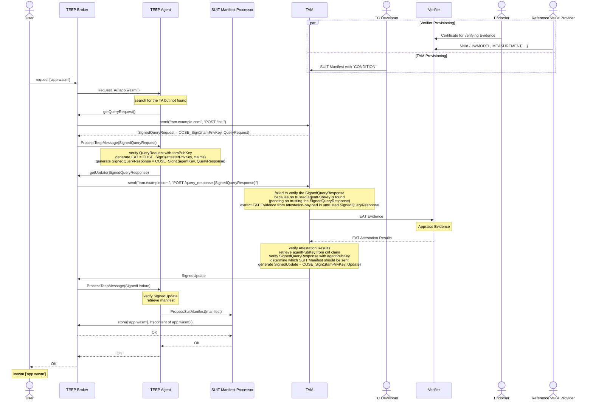

# Detailed Sequence Diagram of this Demo

- Pre-shared Configurations (hardly coded or stored in each components)
    - The TEEP Agent in the Attester holds public keys of the TAM's and the Trusted Component Signer
    - The TAM holds the public key of Verifier, VERAISON
- Provisioning
    - The Endorser and the Reference Value Provider creates CoRIM using public key of the Attester, golden value of measurements, etc.
    - The Trusted Component Signer creates a SUIT Manifest with `['app.wasm']` binary
- The User wants to run `app.wasm`, which will be provided by a TAM (Trusted Application Manager)
    - executes a request command triggering the TEEP Broker and the TEEP Agent
- The TEEP Agent POSTs an empty message to the TAM HTTP endpoint (defined [here](https://datatracker.ietf.org/doc/html/draft-ietf-teep-otrp-over-http-09#section-6.2))
    - indicating that the TEEP Agent wants get QueryRequest from the TAM
- The TAM sends TEEP QueryRequest as HTTP POST response
    - The value of `challenge` should be used generate EAT Evidence, stored in the `eat_nonce` claim
    - The QueryRequest message is signed by the TAM usign `COSE_Sign1` (see [RFC 9052](https://datatracker.ietf.org/doc/html/rfc9052) for detail), `ESP256` (ECDSA with SHA-256 and P-256 curve, see [IANA](https://www.iana.org/assignments/cose/cose.xhtml))
- The TEEP Agent handles the QueryRequest
    - Verifying the `COSE_Sign1` message with the TAM's public key
    - 
- Finish
    - Now the User 