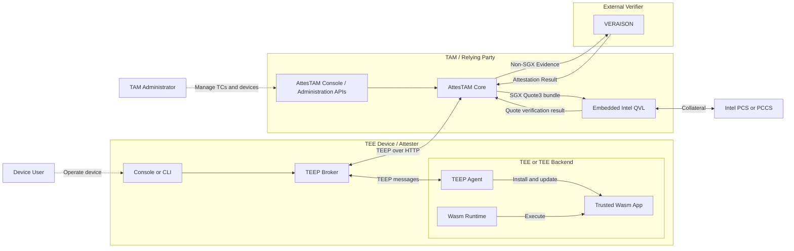

# Common Architecture

The two demo tracks share the same logical TEEP and RATS roles. They differ in the implementation of the device-side components.

## Roles

### Device User

The Device User operates the device through either the TAWS Console or `twep-cli`. The exact actions depend on the selected demo track.

### TAM Administrator

The TAM Administrator uses the AttesTAM Console or the administration APIs to register Trusted Components and inspect managed devices. The Console is a backend-for-frontend that calls the SUIT Manifest Service and TEEP Agent Service APIs. This generic role is independent of the building-security use case used by the TAWS workload.

The current Console does not implement authentication or authorization for its users. It must be exposed only through a controlled route in the demo environment. AttesTAM also models a Device Administrator role, but this book uses TAM Administrator as the generic operator for the demonstrated administration steps.

### TEEP Broker

The TEEP Broker relays TEEP messages between AttesTAM and the TEEP Agent. Communication that requires the rich operating environment, such as HTTP transport, remains outside the TEEP Agent's trusted logic.

### TEEP Agent

The TEEP Agent processes TEEP messages and manages the lifecycle of Trusted Components. TAWS and TWEP-SYSTEM implement this role differently.

### AttesTAM

AttesTAM provides the TAM role and acts as the Relying Party in the attestation flow. It exposes separate SUIT Manifest Service, TEEP Agent Service, and TEEP-over-HTTP interfaces. AttesTAM selects the verifier backend from the `QueryResponse.attestation-payload-format`.

### Verifier Backends

For `application/sgx-quote3-teep-bundle`, AttesTAM uses its experimental embedded Intel QVL backend and obtains Intel collateral from PCS or a compatible PCCS service. For other Evidence formats, AttesTAM uses the external VERAISON challenge-response verifier. After an affirming result, AttesTAM checks the format-specific challenge and TEEP Agent key binding before trusting the key.

The embedded Intel QVL path verifies the SGX Quote's authenticity, integrity, and validity against Intel collateral. It does not by itself appraise Target Environment identity values such as `MRENCLAVE`, `MRSIGNER`, or `ISV_SVN`; any such policy must be documented separately.

## Management and Protocol Paths

The diagram contains two kinds of interaction:

- **Management path**: a TAM Administrator registers Trusted Components and inspects devices through the AttesTAM Console or administration APIs.
- **Protocol path**: the TEEP Broker, TEEP Agent, and AttesTAM exchange provisioning messages, while AttesTAM invokes the verifier backend selected for the Evidence format.

Keeping these paths distinct prevents administrative operations from being confused with TEEP protocol messages.
