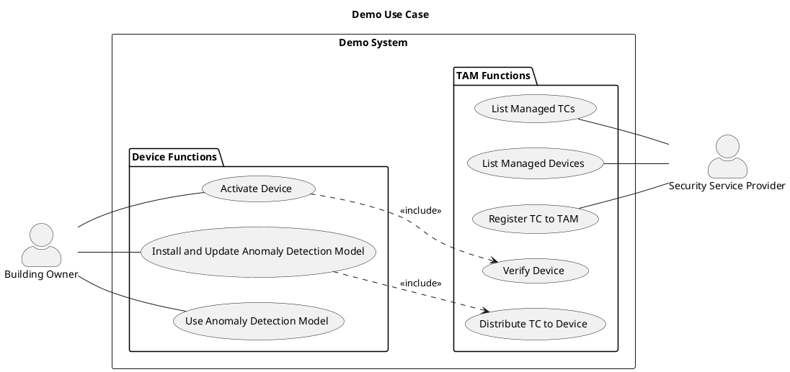
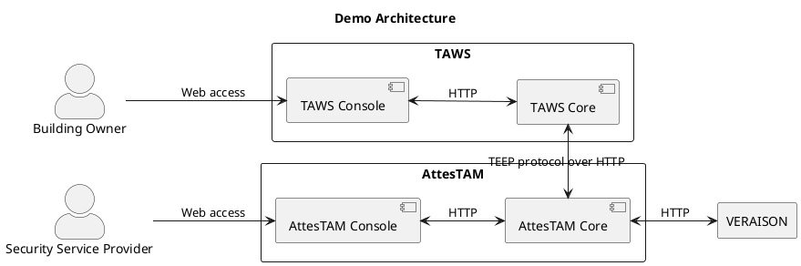

# Introduction

This demo shows a building security service provider provisioning a Wasm-based anomaly detection model to a building security device using TEEP, with device trust established through RATS-based remote attestation.

| Console | Role | Screenshot |
| -- | -- | -- |
| TAWS Console | Used by the building owner to activate the device, install the model, and run detection. |  |
| AttesTAM Console | Used by the security service provider to register and manage trusted components and devices. |  |

## Use Case and Security Concern
The specific situation is as follows:

- Use case
  - A security service provider offers security devices that detect intrusions by installing equipment in customers' buildings.
  - The building security devices embed a proprietary anomaly detection model that identifies suspicious persons from surveillance camera footage.
- Security concern
  - The security service provider is concerned about model leakage and tampering, and wants to protect the model by using a TEE.

The operational flow demonstrated in this project is described in [Demo Scenario](./scenario.md).

The following use case diagram shows interactions between the building owner and security service provider in the demo system.

## Architecture of the demo system

The following diagram shows the architecture of the demo system.

- `TAWS` is a TEEP agent for Intel SGX.
- `AttesTAM` is a TAM (Trusted Application Manager).
- `VERAISON` is the verifier used for attestation.

## Related Repositories

- [teep-wasm-demo](https://github.com/s-miyazawa/teep-wasm-demo)
  - Repository for the IETF 125 hackathon demo
- [AttesTAM](https://github.com/kentakayama/AttesTAM)
  - Repository for AttesTAM and the AttesTAM Console
- [TAWS](https://github.com/yuma-nishi/taws)
  - Repository for TAWS and the TAWS Console
