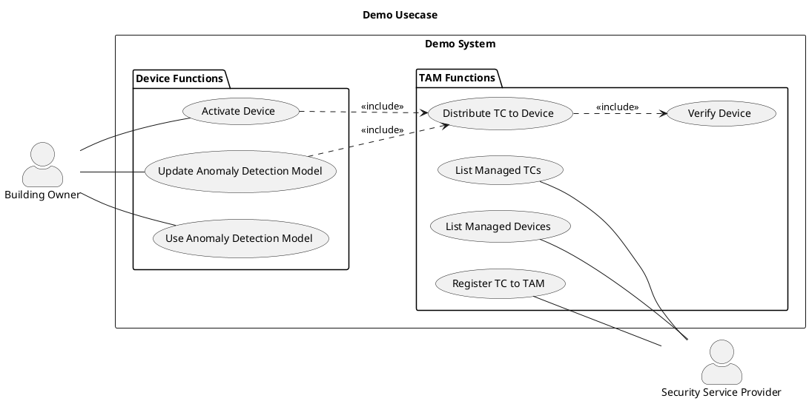
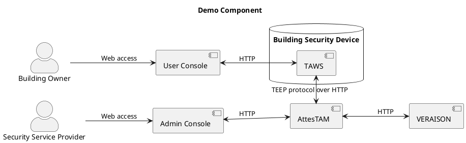

# Demo Purpose

This demo was created to demonstrate how to provision a WebAssembly (Wasm) application running in a Trusted Execution Environment (TEE).
As a security service situation, this demo distributes and updates a Wasm-based anomaly detection model to Intel SGX devices using TEE Provisioning (TEEP).

## Situation
The specific situation is as follows:

- A security service provider offers security devices that detect intrusions by installing equipment in customers' buildings.
- The building security devices embed a proprietary anomaly detection model that identifies suspicious persons from surveillance camera footage.
- The security service provider is concerned about model leakage and tampering, and wants to protect the model by using a TEE.
- The provider also operates many variations of security devices (different CPU architectures), so common TEEP that is independent of specific TEE architectures is required.

This demo aims to show a mechanism that addresses the challenges above.

## Use Case

The following use case diagram shows interactions between the building owner and security service provider in the demo system.

## System Component

The following diagram shows the components of the demo system.

## Terminology in Demo

### Building Owner

Uses the security service for building protection.
- Activate the building security device.
- Use the anomaly detection model.
- Update the anomaly detection model.

### Security Service Provider

A company that provides building security services.
- Manage the building security device.
- Manage the AttesTAM.
- Develop and register to AttesTAM the anomaly detection model.

### Building Security Device

A security device that executes the anomaly detection model.
- Operated from the user console by building owner.
- Installed TAWS at manufacturing.
- Not installed the anomaly detection model until activation.

### Anomaly Detection Model

Object detection Wasm application based on YOLOv8.

### TAWS

TEE middleware for Intel SGX.
- Install/update/execute Wasm application for TEE.
- Interacts with building owner via user console.
- Interacts with AttesTAM using TEEP protocol.

### AttesTAM

Trusted Application Manager (TAM) server supporting TEEP over HTTP.
- Stores and distributes the trusted component.
- Manages the distribution status of the trusted components to TAWS.
- Interacts with security service provider via admin console.
- Interacts with TAWS using TEEP protocol.

### VERAISON

Attestation verification software built by Project VERAISON.

### User Console

Web application for operating TAWS.

### Admin Console

Web application for operating AttesTAM.

## Terminology Mapping

### TEEP

|TEEP|Demo|
|--|--|
|TEE|Intel SGX|
|Trusted Component|Anomaly Detection Model|
|TAM|AttesTAM|
|TEEP Agent TEEP Broker|TAWS|
|Device|Building Security Device|
|Device User|Building Owner|
|Device Administrator|Security Service Provider|

### RATS

|RATS|Demo|
|--|--|
|Attester|Building Security Device|
|Relying Party|AttesTAM|
|Relying Party Owner|Security Service Provider|
|Verifier|VERAISON|
