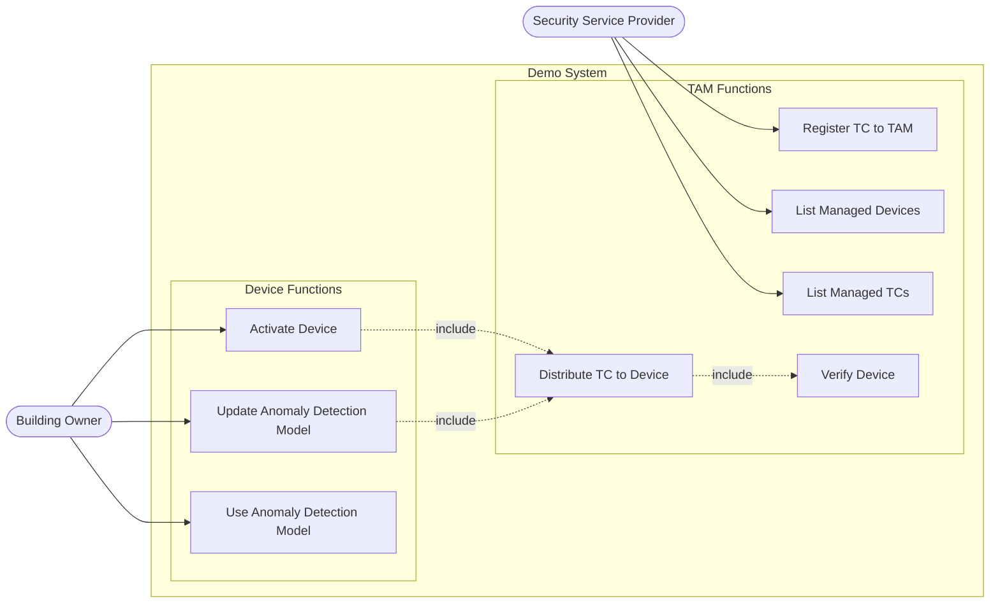
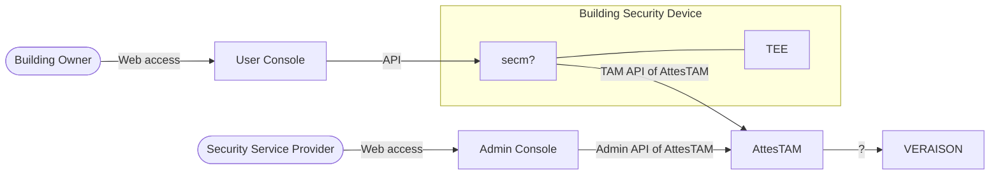

# Demo Purpose

This demo presents a system that securely distributes and updates an anomaly detection model (a Wasm application) running inside a TEE by using the TEEP protocol.

## Situation
The specific scenario is as follows:

- A security service provider offers security devices that detect intrusions by installing equipment in customers' buildings.
- The building security devices embed a proprietary anomaly detection model that identifies suspicious persons from surveillance camera footage.
- The security service provider is concerned about model leakage and tampering, and wants to protect the model by using a TEE.
- The provider also operates many variations of security devices (different CPU architectures), so common TEE provisioning (TEEP) that is independent of specific TEE architectures is required.

This demo aims to show a mechanism that addresses the challenges above.

## Use Case

The following use case diagram shows interactions between the building owner and security service provider in the demo system.

## Architecture

The following diagram shows the logical architecture in this demo.

