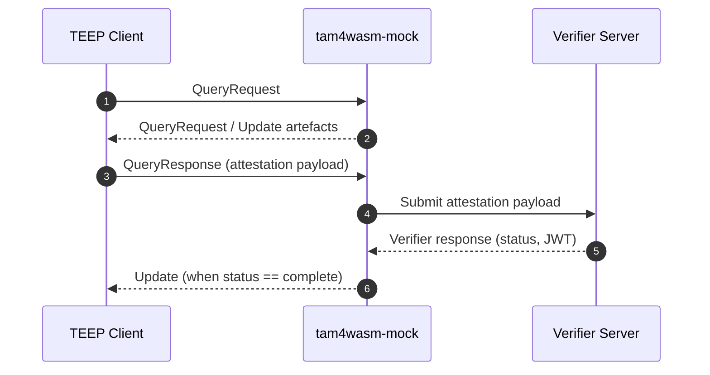

# tam4wasm-mock

`tam4wasm-mock` is a lightweight mock Trusted Application Manager (TAM) server used to exercise WebAssembly-based TEEP (Trusted Execution Environment Provisioning) clients. It serves deterministic responses that model the TEEP QueryRequest / QueryResponse / Update exchange, helping client implementations validate COSE- and CBOR-encoded payload handling without talking to production infrastructure.

## Quick Start

```bash
go run ./cmd/tam4wasm-mock
```

The mock server listens on `localhost:8080` by default and exposes a single endpoint at `POST /tam/`.
Send TEEP messages (COSE Sign1) as the request body and inspect the mock server logs for the corresponding response behaviour. When a verifier endpoint is configured (via `-challenge-server` or the `TAM4WASM_CHALLENGE_SERVER` environment variable), the server forwards attestation payloads and logs the decoded verifier response as soon as it is received—no attestation files are written to disk.

### Command Options

`tam4wasm-mock` accepts the following CLI flags (also configurable via environment variables exported in the Docker image):

| Flag | Env Var | Default | Description |
| ---- | ------- | ------- | ----------- |
| `-addr` | `TAM4WASM_ADDR` | `:8080` | Listen address for the HTTP server. |
| `-disable-cose` | `TAM4WASM_DISABLE_COSE` | `false` | Serve unsigned CBOR artefacts instead of COSE-wrapped ones where available. |
| `-challenge-server` | `TAM4WASM_CHALLENGE_SERVER` | `https://localhost:8443` | Base URL for the verifier challenge-response endpoint. Leave empty to disable verifier submission. |
| `-challenge-content-type` | `TAM4WASM_CHALLENGE_CONTENT_TYPE` | `application/psa-attestation-token` | `Content-Type` header used when posting attestation payloads to the verifier. |
| `-challenge-insecure-tls` | `TAM4WASM_CHALLENGE_INSECURE_TLS` | `true` | Skip TLS verification when contacting the verifier; set to `false` in production-like environments. |
| `-challenge-timeout` | `TAM4WASM_CHALLENGE_TIMEOUT` | `1m` | Timeout for the end-to-end verifier interaction. |

Use `go run ./cmd/tam4wasm-mock -h` to see the latest defaults.

## Docker

```bash
docker build -t tam4wasm-mock .
docker run --rm -p 8080:8080 tam4wasm-mock
```

Set environment variables to mirror the CLI flags when you need verifier connectivity, for example:

```bash
docker run --rm -p 8080:8080 \
  -e TAM4WASM_CHALLENGE_SERVER="https://verifier.example.com" \
  -e TAM4WASM_CHALLENGE_CONTENT_TYPE="application/psa-attestation-token" \
  tam4wasm-mock
```

When testing against a verifier running on the host machine, map `host.docker.internal` and forward TLS traffic back to the host:

```bash
docker run --rm -p 8080:8080 \
  --add-host=host.docker.internal:host-gateway \
  -e TAM4WASM_CHALLENGE_SERVER=https://host.docker.internal:8443 \
  tam4wasm-mock
```

The container bundles the embedded CBOR fixtures under `/app/resources` but no attestation response files are persisted during runtime.

## Architecture Overview



## Repository Layout

- `cmd/tam4wasm-mock/` – entrypoint wiring configuration, logging, and HTTP server startup.
- `internal/server/` – HTTP handler and utilities for message detection, CBOR rendering, verifier challenge interactions, and in-memory attestation bookkeeping.
- `resources/` – embedded CBOR fixtures (query/update payloads) and generated artefacts surfaced by the test tools.

## Development Workflow

```bash
go build ./...   # Compile against Go 1.25
go test  ./...   # Run unit and integration tests
go run   ./cmd/tam4wasm-mock  # Local smoke check
```

The handler logs every received TEEP message type and, for `QueryResponse`, pretty prints the COSE payload CBOR before forwarding field `7` (attestation blob) to the configured verifier. The resulting verifier response is decoded, logged, and cached in memory only.

## Contributing

1. Write focused changes organised under `internal/` packages; keep shared code small and single-purpose.
2. Format with `gofmt`/`goimports`, use PascalCase for exported identifiers, and wrap errors with context (`fmt.Errorf("...: %w", err)`).
3. Add or update tests alongside the code in `*_test.go` files; store golden fixtures under `testdata/`.
4. Ensure `go fmt`, `go test ./...`, and `go vet ./...` succeed before submitting a PR.
5. Use imperative commit messages (e.g., `Add QueryResponse attestation logging`) and include motivation plus verification details in the pull request description.

Refer to `AGENTS.md` for a deeper contributor guide covering structure, testing expectations, and review checklists.

## Call Graph


